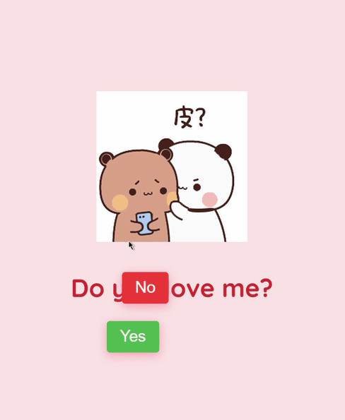

# Do You Love Me?



A tiny playful web page that asks "Do you love me?" with two buttons — **Yes** and a moving **No** — that avoids being clicked. Clicking **Yes** reveals a heart animation / GIF and a loving message. Built with plain HTML, CSS and JavaScript (no build step).

---

## TL;DR

Open `index.html` in a browser (or serve the folder with a static server). Click **Yes** to see the loader → heart → GIF result. Hover over **No** to watch it run away.

---

## Features

- Cute question UI with a Tenor embed and GIPHY result.
- Playful UI: the No button jumps on hover.
- A small heart-loading animation before showing the final GIF.
- Lightweight: no frameworks required.

---

## Demo

- Live demo: *Add a GitHub Pages URL or your hosted link here if you deploy it.*
- Preview: see `screenshot.png` at repo root (recommended).

---

## Tech

- HTML5
- CSS3 (vanilla)
- JavaScript (vanilla)
- External assets: Google Fonts, Tenor embed, GIPHY GIF link

---

## Getting started

### Prerequisites

Nothing special — modern browser is enough. If you want to run a tiny local server:

- Using Python 3:
```bash
# from project root
python -m http.server 5500
# then open http://localhost:5500 in your browser
```